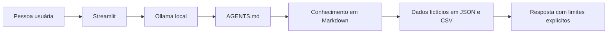

# 1. Documentação do agente

## Problema e público

A Lary ajuda pessoas iniciantes a entender o próprio orçamento, estimar uma
referência de reserva de emergência e aprender conceitos básicos de investimento.
O cenário simula uma experiência bancária, mas não possui integração oficial com
o Bradesco nem acesso a contas reais.

## Comportamento

A agente usa linguagem simples, explica antes de apresentar alternativas e
separa dados do cenário, cálculos derivados e fatos que precisam ser confirmados.
Ela não promete retorno nem substitui atendimento profissional.

## Arquitetura

O `AGENTS.md` é o prompt principal. `src/app.py` carrega a persona, o conhecimento
e os dados, calcula os totais do cenário e envia o contexto ao Ollama local. O
modelo responde pela interface do Streamlit sem adicionar fatos ausentes.

## Segurança e anti-alucinação

- Dados pessoais e transações são identificados como fictícios.
- Nenhuma taxa comercial é apresentada como vigente.
- O agente não acessa contas, movimenta dinheiro ou coleta credenciais.
- A tolerância a risco e a reserva limitam as alternativas explicadas.
- Perguntas sem base suficiente recebem uma declaração de limitação.
- Condições atuais devem ser confirmadas em canais oficiais.

## Limitações

O protótipo depende de Python, Streamlit, Ollama e de um modelo local instalado.
Não há atualização automática, autenticação, integração bancária ou garantia de
que modelos diferentes produzirão exatamente o mesmo texto.
